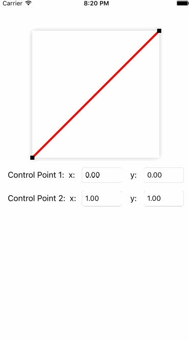

# TimingFunctionPainter
A tool for painting timing function curves.

## Problem
When I'm going to create a more interesting `CAMediaTimingFunction` for `CAAnimation`, I can't imagine the function curve that are generated from control points in method `functionWithControlPoints::::`.

## Solution
This tool will show you the function curve with given control points. It also can drag the control point to make the function curve what you want.

## Preview

